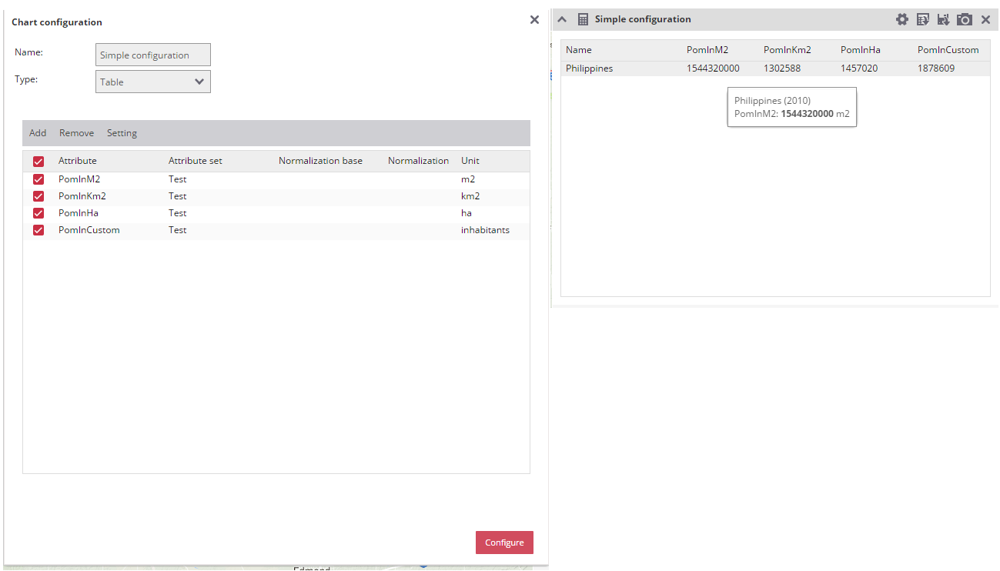
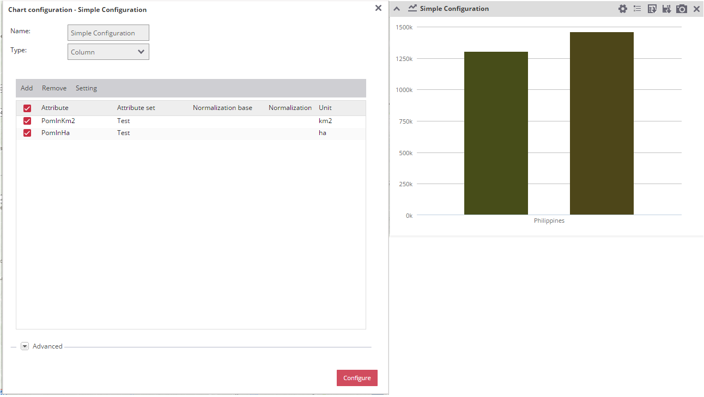
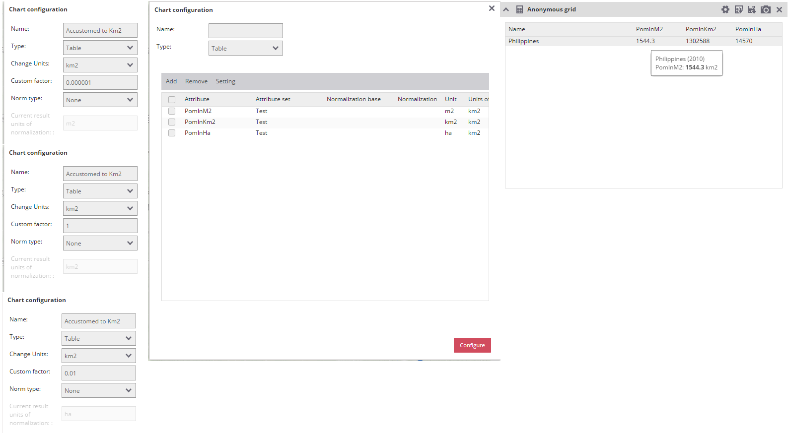

# Units

The source unit for an attribute is set in the BackOffice. This source unit says what unit is the representation of the data in. 
 
In the FrontOffice, it is possible to display the values stored under the attributes using different type of charts. There are multiple ways how the values could be adapted before the final display of the chart to the user. The simplest way is to simply show the values using table. 
 
## Show the values without changes

For this use case it is enough to open the configuration of the chart. Choose the correct type of the chart and select the attributes, which will be visualised. The units which will be shown in the legend are the same as in the BackOffice. For the reference they are also displayed in the table of atributes to display in the chart.  

### Table

### Column

## Show the values changed to different display unit. 

This use case allows you to display the data in different units than the source one provided to the attribute in the BackOffice. First example will show how to update all shown attributes so that they are displayed in the km2 instead of the default units. 

There two important things that these settings does. The first one is changing the unit in the legend. This is done via the select Change Units. If you select some unit here, this is the unit which will be displayed in the legend. The second one is to update the values to a different one before showing the value to the user. This is handled via the Custom Factor field. This scenario has two options. First is that the source units are recognized by the system in which case the custom factor will be filled by the default factor. If the source units aren't recognized by the system the factor will be filled by 1 by default. It is possible to use any factor as long as it is number. The value is simply multiplied by the factor before being returned for display. 

### Table

## Show the values normalized to the area

In this use case you have attribute in any units and want to show the statistical information based upon the area. This have again two possible ways to be displayed. First is that the units of the source attribute is standard supported by the system. Second is that the  

The modification of the units and values using normalization. 

The modification of the units and values using custom factor and change of units. Changing units sets the units, which will be used and adds custom factor which will be used to adapt values. The user then will always see the units, which were set. It happens regardless of normalization, if it is set.    

There are four basic use cases. First is no normalization, Second is no normalization with update to another place. Third is normalization without update of units. Fourth is normalization with update of units. Let's move on after this area changes. 

## Show the values normalized to another attribute

## Show the values normalized to another attribute set

