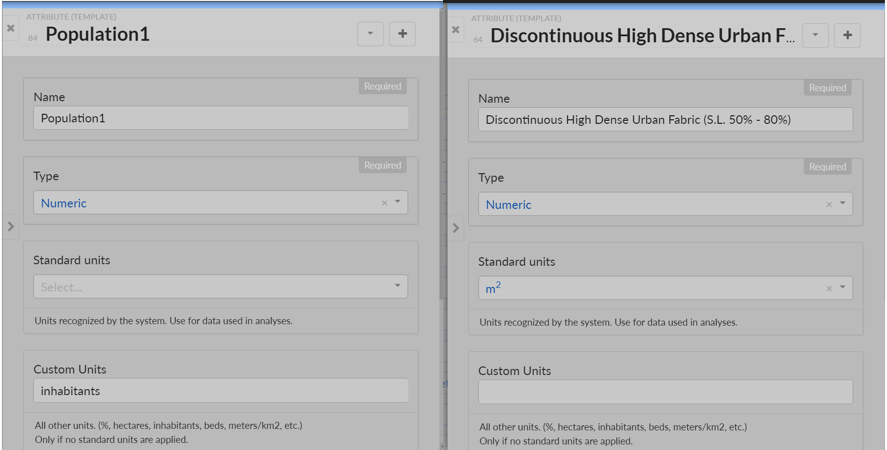
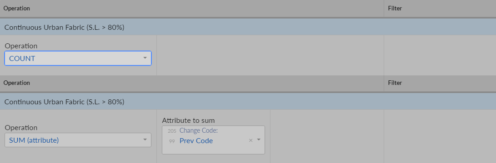
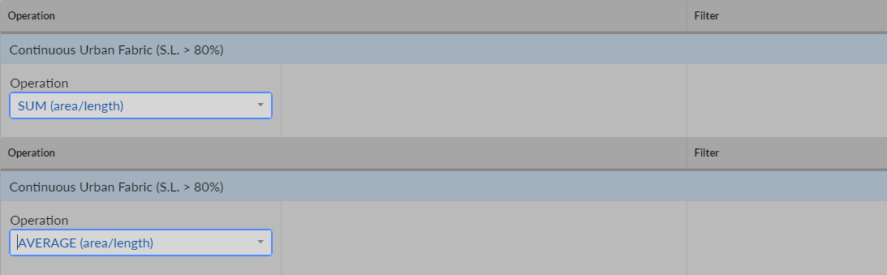
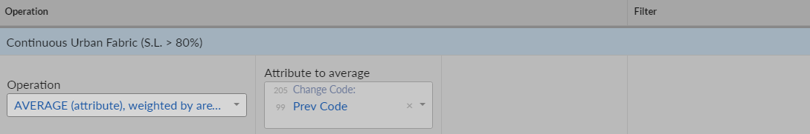
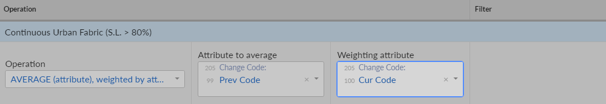
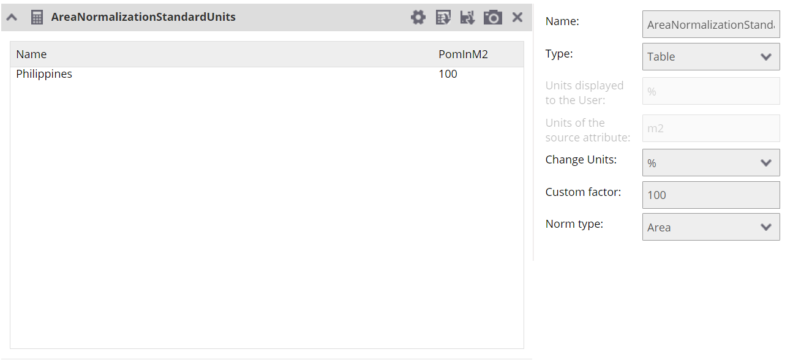
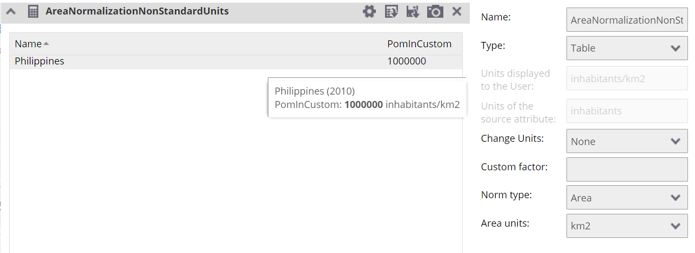
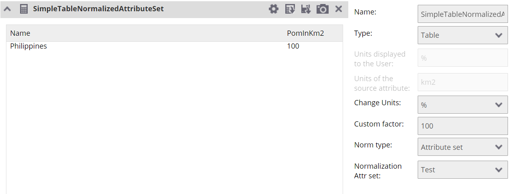

# Units - BackOffice

There are two places which are important with respect to units in BackOffice. First is setting the units of the attribute. These units represent in which units the attribute is represented in the data. These units are also shown without any normalization or update to units in the FrontOffice charts. 

## Attribute units

When creating or updating the attribute it is possible to specify the units. There are two types of units. Standard units and custom units. It is always possible to set only either standard units or custom units. These units express what units the values in the data are. They are also by default shown in the charts.
 

## Analysis units

It is important to take into account units for the spatial aggregation analysis. Depending on the exact type of the analysis there are multiple units, which can be taken into account. 

### No changes

In this case it either counts the amount of units in all more detailed units or sums all attributes in the given area. There is no change in the units and in the FrontOffice they are shown as explained in further section. 

### Normalization over area

Handling of this dependts on whether the units of target attribute are standard or custom. If the units are standard, then the result which is counted in m2 is transformed to the target unit by dividing it using appropriate number. If the units are nonstandard the data remains unchanged after the operation itself.  

### Attribute weighted by area

In this case there is one attribute, which is relevant for the operation and the resulting attribute. If both of these attributes are in standard units, it is possible to update resulting value by the fraction representing the relationship between all three units. One of them is source units, second is area which is always in m2 and third is resulting attribute. Basically the whole process goes as: 
 
1. Get the factor between source unit and m2
2. Get the factor between this first factor, which is counted such as if it was in m2 and the result attribute unit. 

If any of the attributes is non standard no operation happen on the result. 
 

 
### Attribute weighted by another attribute

This use case is very similar to the previous one, except that instead of the m2 unit of the area there is unit of the third attribute. 

# Units - FrontOffice

The source unit for an attribute is set in the BackOffice. This source unit says what unit is the representation of the data in. 
 
In the FrontOffice, it is possible to display the values stored under the attributes using different type of charts. There are multiple ways how the values could be adapted before the final display of the chart to the user. The simplest way is to simply show the values using table. 
 
## Show the values without changes

For this use case it is enough to open the configuration of the chart. Choose the correct type of the chart and select the attributes, which will be visualised. The units which will be shown in the legend are the same as in the BackOffice. For the reference they are also displayed in the table of atributes to display in the chart.  

### Table

### Column

## Show the values changed to different display unit. 

This use case allows you to display the data in different units than the source one provided to the attribute in the BackOffice. First example will show how to update all shown attributes so that they are displayed in the km2 instead of the default units. 

There two important things that these settings does. The first one is changing the unit in the legend. This is done via the select Change Units. If you select some unit here, this is the unit which will be displayed in the legend. The second one is to update the values to a different one before showing the value to the user. This is handled via the Custom Factor field. This scenario has two options. First is that the source units are recognized by the system in which case the custom factor will be filled by the default factor. If the source units aren't recognized by the system the factor will be filled by 1 by default. It is possible to use any factor as long as it is number. The value is simply multiplied by the factor before being returned for display. 

### Table

## Show the values normalized to the area

In this use case you have attribute in any units and want to show the statistical information based upon the area. This have again two possible ways to be displayed. First is that the units of the source attribute is standard supported by the system. Second is that the units of the source attribute are in nonstandard units such as inhabitants.  

### Source units are standards

In this case the default resulting unit is %. Unless you change the unit to one of the standard and/or update the custom factor, the value in the data will be divided by the area, adapted to difference in units and then multiplied by 100 and % is shown as the unit. 

### Source units are nonstandard

In this case there is one more setting to take into account. It is possible to select the units over which the default values will be normalized. If for example we have the source attribute in inhabitants as units, the default resulting unit will be inhabitants/m2. It is possible to specify other standard units changing the result for example to inhabitants/km2. 

## Show the values normalized to the attribute set

The normalization is happening against another attribute set. In order for this normalization to work it is necessary to use attribute set, which contain the same attribute. The result is then in the percentage and the value created by the division of values in two different attribute sets are multiplied by 100. 

## Show the values normalized to the attribute

It is a bit similar to previous choice in the fact that the values from the source attribute are divided by the result attribute. The main difference is that here you are choosing the exact attribute to be used in division. The value is then afterwards multiplied by 100 and shown in percentage, unless specified otherwise. 